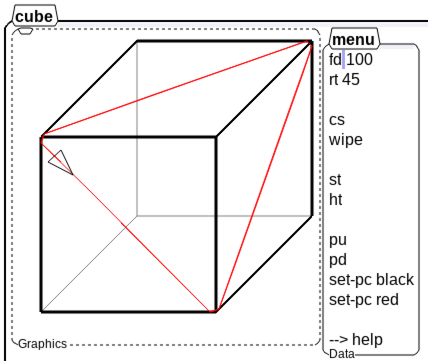
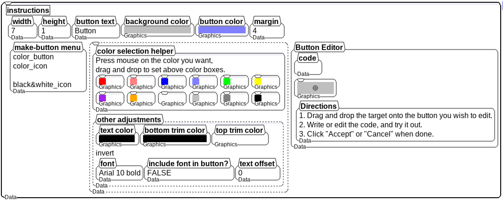
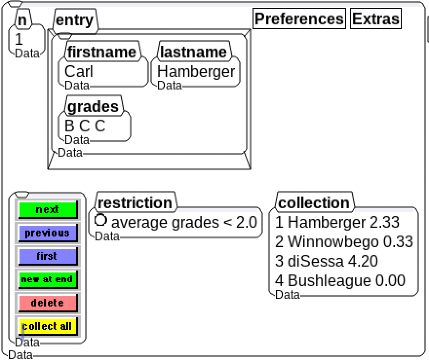
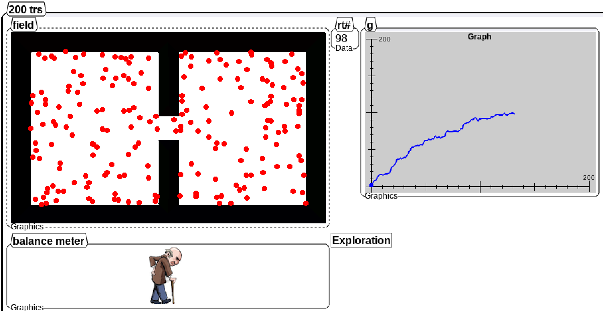
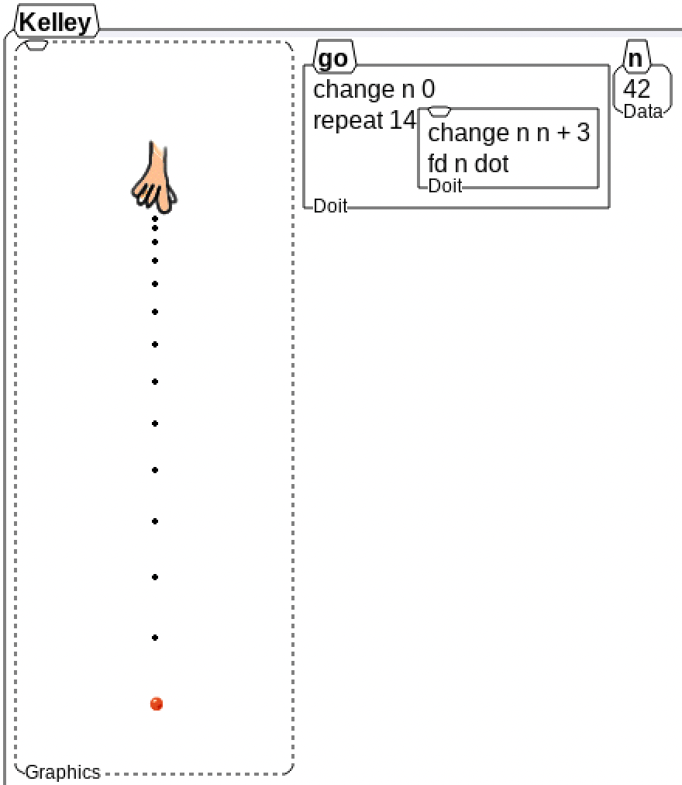
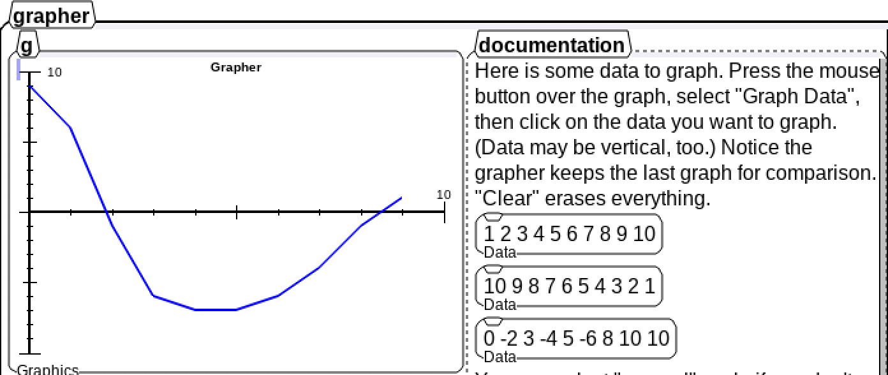
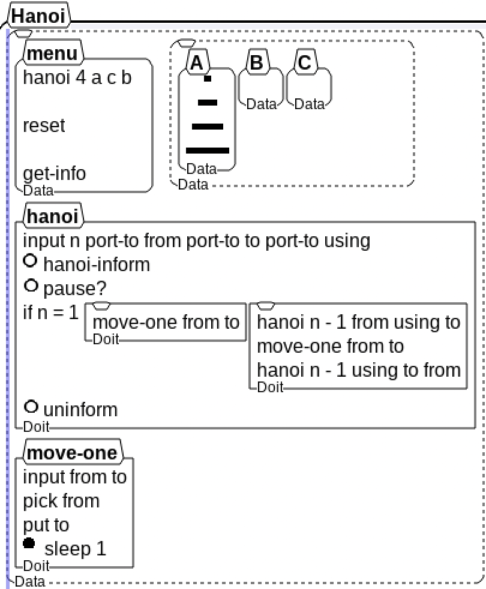
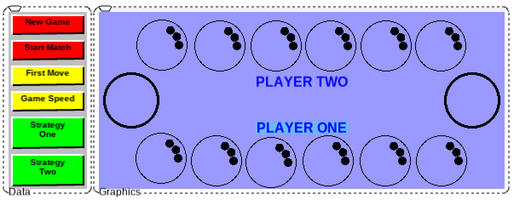
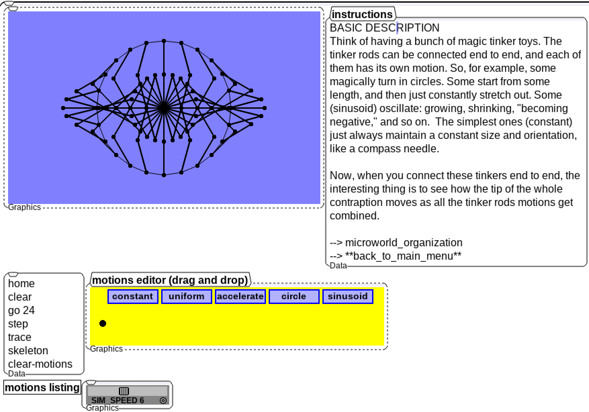
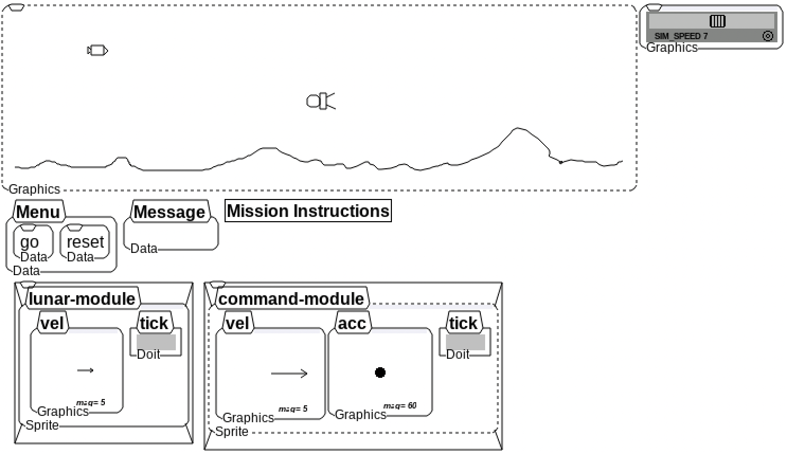

# Demo Set

This folder contains a set of historic demo microworlds for the boxer project.

## Annotated Cube

A 3D cube with redefined turtle commands to draw on the cube rather than a 2D
plane.

## Button Factory

A microworld toolkit for creating buttons with customizable colors, labels, and
instructions to evaluate on click. These buttons can then be cut and pasted for
use in your own microworlds. Shows the use of Boxer colors as well as implementing
drop and drop using Boxer primitives.

## Database Tool

An example and template tooling for creating databases in Boxer. The database
consists of box of boxes underneath, representing the "rows" of data. On top of
this native Boxer data structure are tools for creating, reading, updating, and
deleting data.

## Diffusion for Citizen Schools

An entertaining simulation of gas particles equalizing between two chambers
with configurable parameters and realtime graph of ration during evaluation.

## Drop Sims

A teaching activity used with sixth grade students to explore the physics of
dropping a ball.

## Grapher

A toolkit for graphing/plotting a sequence of numbers. Allows drawing the graph
by hand as well, and selecting data from a box.

## Hanoi

The classic Towers of Hanoi problem solves and animated in Boxer with
supplemental notes and comments.

## Mankala

A turn-based strategy game played with small stones on a board with 14 pits. The
objective is to collect the most stones.

## Tinker

A magical tinker toy style simulation that allows building animations and stucture
from a drag and drop motions editor.

## Vectors Demo

A substantial microworld contains tooling for creating graphics basics vectors
that can be edited with the mouse and supporting vector addition. Includes several
games and simulations built off vectors created with the tooling to let students
explore velocity and acceleration by piloting space ships in several scenerios.

